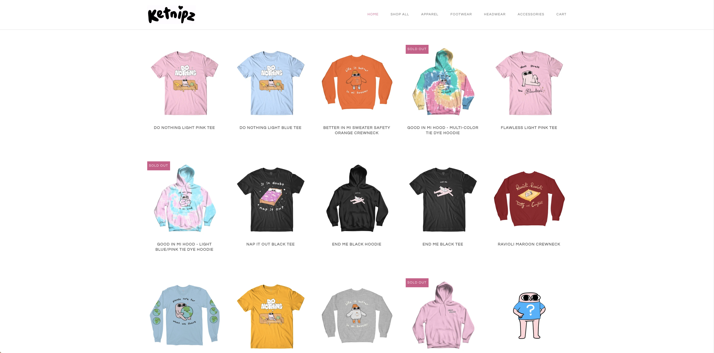

# Google Cloud Platform Image Recognition Algorithm

Hi, welcome to my project! What I've built for this challenge is an algorithm that takes in an image and outputs a list of object names with their confidence values and a list of vertices circling where the object is in the image. (See the test cases at the bottom of the read me to see what it means exactly) 

In shopify, every store that uses the platform is filled with images on products, brands and so on. With vast amounts of images used for marketing products, shops and brand images, this algorithm can identify the objects in each image, and (with the addition of text classifiers in the future) can map shops to clusters more accurately and give insights into how and what shop owners like to put on their pages. 

This image recognition algorithm was derived from a subset of a classifier project that I was working on in a previous term, where we were trying to identify whether or not a store serves alchol through finding alcholic beverages in the images. I figured this was a great overlap since we used GCP's API (which according to the job description is also the cloud Shopify uses), and it happens to be about images. I hope you can get something out of this. Enjoy! 

Note that this application uses Google Cloud Platform's Vision AI image recognition algorithm, and will require a service key to work. 

## Requirements

Google Cloud Account with an enabled project 

Google Service Account Key (see https://cloud.google.com/compute/docs/access/create-enable-service-accounts-for-instances) 

## How to use:

### Step 1: 

Download the git repo, Copy paste your service_account.json file into the service_key.json file in the current repository and install the required packages

### Step 2: 

Put the images you wish to classify in the test_input folder, and modify the script to get the files

### Step 3: 

Run the script, and your file should be in the ouput.txt file, you may modify the script to reroute the output.txt file or write into a database

## How to improve on the project
1. Larger Volumes of images (read from database, run script, write to database)

2.Data Visualization (Get more insights e.g. What image is used the most for X cluster) 

3. GUI or better frontend 

4. Orchastration, scheduled updates to get new images on a daily basis (Airflow or Kubeflow)

5. Combine result with text classifiers (vectorize the result with text classifiers to improve on the algorithm) 

6. Use of big data tools to multithread the process (although I'm not sure if GCP can handle big data ML, need further testing) 

## Test_1 

## Input: 

## Output: 

Number of objects found: 10

Watch (confidence: 0.9202269315719604)Normalized bounding polygon vertices:  - (0.13823191821575165, 0.1626967340707779) - (0.2276538461446762, 0.1626967340707779) - (0.2276538461446762, 0.4611910581588745) - (0.13823191821575165, 0.4611910581588745)

Watch (confidence: 0.9191744923591614)Normalized bounding polygon vertices:  - (0.019053377211093903, 0.5680782198905945) - (0.25602054595947266, 0.5680782198905945) - (0.25602054595947266, 0.734943151473999) - (0.019053377211093903, 0.734943151473999)

Person (confidence: 0.9110227227210999)Normalized bounding polygon vertices:  - (0.47731050848960876, 0.7391592860221863) - (0.6444106698036194, 0.7391592860221863) - (0.6444106698036194, 0.9962978959083557) - (0.47731050848960876, 0.9962978959083557)

Person (confidence: 0.9059911966323853)Normalized bounding polygon vertices:  - (0.8492130637168884, 0.7475652098655701) - (0.9941837191581726, 0.7475652098655701) - (0.9941837191581726, 0.992985725402832) - (0.8492130637168884, 0.992985725402832)

Person (confidence: 0.9014054536819458)Normalized bounding polygon vertices:  - (0.15933024883270264, 0.7391183972358704) - (0.3092644512653351, 0.7391183972358704) - (0.3092644512653351, 0.9961052536964417) - (0.15933024883270264, 0.9961052536964417)

Person (confidence: 0.9001266956329346)Normalized bounding polygon vertices:  - (0.275971919298172, 0.12811927497386932) - (0.9223171472549438, 0.12811927497386932) - (0.9223171472549438, 0.7218050956726074) - (0.275971919298172, 0.7218050956726074)

Sunglasses (confidence: 0.8906610608100891)Normalized bounding polygon vertices:  - (0.501814067363739, 0.10372335463762283) - (0.622297465801239, 0.10372335463762283) - (0.622297465801239, 0.2740924060344696) - (0.501814067363739, 0.2740924060344696)

Outerwear (confidence: 0.8715665936470032)Normalized bounding polygon vertices:  - (0.4838716685771942, 0.8512343764305115) - (0.6404725909233093, 0.8512343764305115) - (0.6404725909233093, 0.9973958134651184) - (0.4838716685771942, 0.9973958134651184)

Top (confidence: 0.8490291237831116)Normalized bounding polygon vertices:  - (0.8530711531639099, 0.8509180545806885) - (0.984931230545044, 0.8509180545806885) - (0.984931230545044, 0.9932665824890137) - (0.8530711531639099, 0.9932665824890137)

Top (confidence: 0.81346195936203)Normalized bounding polygon vertices:  - (0.16125506162643433, 0.8715503811836243) - (0.30010858178138733, 0.8715503811836243) - (0.30010858178138733, 0.99542635679245) - (0.16125506162643433, 0.99542635679245)

## Test_2

## Input: 

## Output: 
Number of objects found: 4

Jug (confidence: 0.8859262466430664)Normalized bounding polygon vertices:  - (0.48973512649536133, 0.06964999437332153) - (0.7321767210960388, 0.06964999437332153) - (0.7321767210960388, 0.6653507351875305) - (0.48973512649536133, 0.6653507351875305)

Tableware (confidence: 0.7439845204353333)Normalized bounding polygon vertices:  - (0.5884758234024048, 0.29087480902671814) - (0.8424186706542969, 0.29087480902671814) - (0.8424186706542969, 0.6717195510864258) - (0.5884758234024048, 0.6717195510864258)

Tableware (confidence: 0.6241264939308167)Normalized bounding polygon vertices:  - (0.5056851506233215, 0.07902448624372482) - (0.7235023379325867, 0.07902448624372482) - (0.7235023379325867, 0.6338502764701843) - (0.5056851506233215, 0.6338502764701843)

Tableware (confidence: 0.5782670974731445)Normalized bounding polygon vertices:  - (0.262482225894928, 0.4022570550441742) - (0.41842591762542725, 0.4022570550441742) - (0.41842591762542725, 0.7054791450500488) - (0.262482225894928, 0.7054791450500488)

## Test_3

## Input: 

## Output: 
Number of objects found: 2

Houseplant (confidence: 0.7535287737846375)Normalized bounding polygon vertices:  - (0.6034814715385437, 0.7095484137535095) - (0.7147200703620911, 0.7095484137535095) - (0.7147200703620911, 0.9282594323158264) - (0.6034814715385437, 0.9282594323158264)

Window (confidence: 0.618610680103302)Normalized bounding polygon vertices:  - (0.8576018214225769, 0.06024782732129097) - (0.9973958134651184, 0.06024782732129097) - (0.9973958134651184, 0.6522799134254456) - (0.8576018214225769, 0.6522799134254456)

## Test_4

## Input: 

## Output: 
Number of objects found: 3

Animal (confidence: 0.8693267703056335)Normalized bounding polygon vertices:  - (0.5464500784873962, 0.07503174245357513) - (0.9641265273094177, 0.07503174245357513) - (0.9641265273094177, 0.9410836696624756) - (0.5464500784873962, 0.9410836696624756)

Animal (confidence: 0.8574328422546387)Normalized bounding polygon vertices:  - (0.37095701694488525, 0.30803361535072327) - (0.5527566075325012, 0.30803361535072327) - (0.5527566075325012, 0.9756706953048706) - (0.37095701694488525, 0.9756706953048706)

Animal (confidence: 0.8418520092964172)Normalized bounding polygon vertices:  - (0.07010115683078766, 0.3074581027030945) - (0.28576982021331787, 0.3074581027030945) - (0.28576982021331787, 0.9447395205497742) - (0.07010115683078766, 0.9447395205497742)

## Test_5

## Input: 

## Output: 
Number of objects found: 10

Top (confidence: 0.9412533044815063)Normalized bounding polygon vertices:  - (0.4403996169567108, 0.15499044954776764) - (0.5517216920852661, 0.15499044954776764) - (0.5517216920852661, 0.3138822913169861) - (0.4403996169567108, 0.3138822913169861)

Top (confidence: 0.939804196357727)Normalized bounding polygon vertices:  - (0.690150797367096, 0.14189459383487701) - (0.786999523639679, 0.14189459383487701) - (0.786999523639679, 0.3276776671409607) - (0.690150797367096, 0.3276776671409607)

Top (confidence: 0.9388008713722229)Normalized bounding polygon vertices:  - (0.20899240672588348, 0.1409355252981186) - (0.3047197759151459, 0.1409355252981186) - (0.3047197759151459, 0.33047184348106384) - (0.20899240672588348, 0.33047184348106384)

Top (confidence: 0.9378721714019775)Normalized bounding polygon vertices:  - (0.3290996551513672, 0.13720808923244476) - (0.4239545166492462, 0.13720808923244476) - (0.4239545166492462, 0.3272921144962311) - (0.3290996551513672, 0.3272921144962311)

Top (confidence: 0.9358709454536438)Normalized bounding polygon vertices:  - (0.5765213370323181, 0.14411824941635132) - (0.6635414958000183, 0.14411824941635132) - (0.6635414958000183, 0.3277455270290375) - (0.5765213370323181, 0.3277455270290375)

Top (confidence: 0.9200479388237)Normalized bounding polygon vertices:  - (0.44384050369262695, 0.8106492161750793) - (0.550233781337738, 0.8106492161750793) - (0.550233781337738, 0.9737231731414795) - (0.44384050369262695, 0.9737231731414795)

Top (confidence: 0.9176855683326721)Normalized bounding polygon vertices:  - (0.6891677975654602, 0.4802190959453583) - (0.7881424427032471, 0.4802190959453583) - (0.7881424427032471, 0.6472713351249695) - (0.6891677975654602, 0.6472713351249695)

Top (confidence: 0.9151800870895386)Normalized bounding polygon vertices:  - (0.5687870383262634, 0.4706507623195648) - (0.6680231094360352, 0.4706507623195648) - (0.6680231094360352, 0.6553919911384583) - (0.5687870383262634, 0.6553919911384583)

Top (confidence: 0.912715494632721)Normalized bounding polygon vertices:  - (0.3276776075363159, 0.7963211536407471) - (0.4266541302204132, 0.7963211536407471) - (0.4266541302204132, 0.9872927069664001) - (0.3276776075363159, 0.9872927069664001)

Top (confidence: 0.9118920564651489)Normalized bounding polygon vertices:  - (0.327284574508667, 0.46649467945098877) - (0.42587217688560486, 0.46649467945098877) - (0.42587217688560486, 0.6599672436714172) - (0.327284574508667, 0.6599672436714172)

## Test_6

## Input: 

## Output: 

Number of objects found: 4

Dog (confidence: 0.859123706817627)Normalized bounding polygon vertices:  - (0.07287832349538803, 0.08948098868131638) - (0.5458978414535522, 0.08948098868131638) - (0.5458978414535522, 0.9473968148231506) - (0.07287832349538803, 0.9473968148231506)

Houseplant (confidence: 0.7843143343925476)Normalized bounding polygon vertices:  - (0.81277996301651, 0.44156965613365173) - (0.9937962889671326, 0.44156965613365173) - (0.9937962889671326, 0.8231860995292664) - (0.81277996301651, 0.8231860995292664)

Table (confidence: 0.6984620094299316)Normalized bounding polygon vertices:  - (0.7455878853797913, 0.7218756675720215) - (0.9972505569458008, 0.7218756675720215) - (0.9972505569458008, 0.9912564754486084) - (0.7455878853797913, 0.9912564754486084)

Flowerpot (confidence: 0.6090550422668457)Normalized bounding polygon vertices:  - (0.8538382649421692, 0.6269773840904236) - (0.9939472675323486, 0.6269773840904236) - (0.9939472675323486, 0.8157865405082703) - (0.8538382649421692, 0.8157865405082703)
